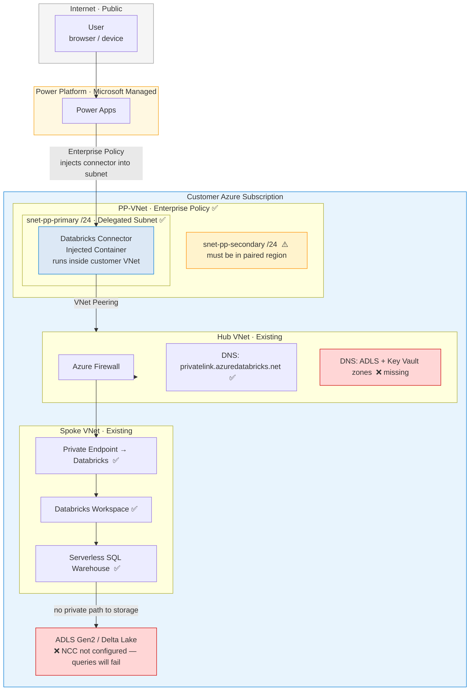
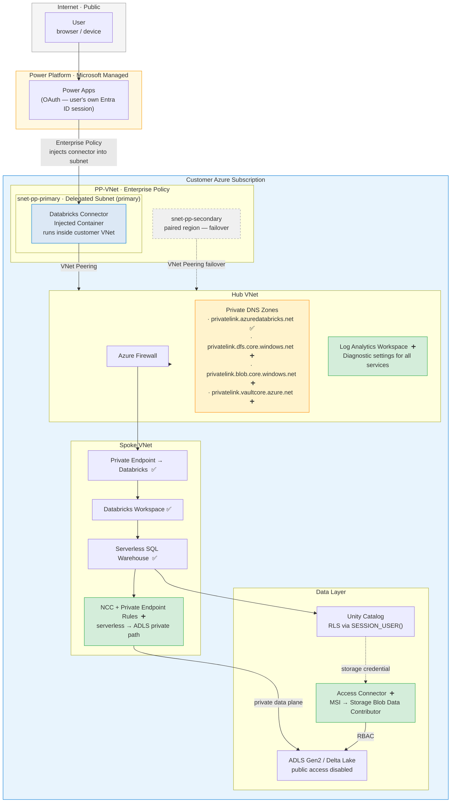

# Scenario A: Native Connector — Architecture Brief

**Prepared for**: [Customer Name]
**Date**: June 2026

---

## Summary

Your proposed architecture correctly identifies the right services and establishes a sound networking foundation. With four targeted additions — serverless networking, DNS coverage, reverse peerings, and an observability stack — the native Power Apps → Databricks connector path is production-ready. No new application layer is required.

---

## Your Current Design



**What you have right**: Enterprise Policy with VNet injection, hub-spoke with Databricks behind Private Endpoint, Databricks DNS zone.

---

## What is Missing

Private connectivity requires three layers to work end-to-end. Your design covers Layer 1 and part of Layer 2.

```
Layer 1 — Enterprise Policy (VNet Injection)       ✅ In place
  Power Apps connector traffic routes through your VNet.

Layer 2 — Private Endpoints + Private DNS          ⚠️ Partial
  Services resolve to private IPs — not public ones.
  You have: Databricks endpoint and DNS zone.
  Missing:  ADLS Gen2 and Key Vault DNS zones.

Layer 3 — NCC (Databricks serverless)              ❌ Not configured
  The Serverless SQL Warehouse runs in Databricks-managed
  infrastructure outside your VNet. Without NCC it has no
  private route to your storage — every query fails at data read.
```

---

## What We Propose



Legend: ✅ already present · ➕ must be added

---

## Additions Required

### Connectivity (networking team + Databricks admin)

| Addition | Why | Owner | Blocks production? |
|---|---|---|---|
| NCC — private endpoint rules for ADLS | Serverless SQL Warehouse cannot reach private storage without this — all queries fail | Databricks admin | **Yes** |
| Private DNS zones — ADLS (dfs + blob) | Without these, storage traffic falls back to public internet | Networking team | **Yes** |
| Private DNS zone — Key Vault | Required if Key Vault is accessed privately | Networking team | If KV is used |
| Hub VNet reverse peerings | Return traffic has no route back to Power Platform without this | Networking team | **Yes** |
| DLP confirmation — Databricks connector in Business tier | Connector cannot be used until confirmed in PPAC | Security / CloudX | **Yes** |

### Security & identity (platform team)

| Addition | Why | Owner |
|---|---|---|
| Databricks Access Connector | Managed identity for Unity Catalog storage credentials — no PAT or secret | Platform team |
| Unity Catalog permissions + RLS | Per-user row filtering using `SESSION_USER()` — the connector passes the user's own Entra ID token natively | Data Platform team |

### Observability (platform team)

| Addition | Why | Owner |
|---|---|---|
| Log Analytics Workspace | Central destination for all service logs | Platform team |
| Diagnostic settings — Databricks | Audit log of who ran which query and when | Platform team |
| Diagnostic settings — ADLS | Record of all storage reads and writes | Platform team |
| Diagnostic settings — Azure Firewall | Full traffic audit through the hub | Networking team |
| Azure Monitor Alerts | Notify on warehouse failures and storage access errors | Platform team |

> **Why observability is required here**: the customer requirement states Entra ID authentication with Unity Catalog row-level security. Access control enforces *who can see what*. Audit logging proves *who did see what*. Without logging, the security posture is incomplete — there is no forensic record if a data access incident needs to be investigated.

### Operational readiness

| Addition | Why | Owner |
|---|---|---|
| Admin access path (Azure Bastion or VPN to spoke) | Once public workspace access is disabled, developers and admins have no way to reach the workspace UI without this | Networking team |
| ADLS soft delete (7–30 day retention) | Minimum protection against accidental table drops before production workloads begin | Platform team |

---

## What Does Not Change

- Enterprise Policy and VNet injection — keep as-is
- Hub-spoke VNet topology — keep as-is  
- Databricks workspace Private Endpoint — keep as-is
- Databricks DNS zone — keep, extend to Hub VNet

The existing design is not replaced. All additions are additive.

---

## Authentication Model

The native connector uses **OAuth 2.0 delegated authentication** — the signed-in Power Apps user's own Entra ID session is passed directly to Databricks. This means:

- No stored credentials anywhere
- Each user's identity flows through to Unity Catalog automatically
- `SESSION_USER()` returns the real user's UPN — row-level security filters apply without any application code

Each Power Apps user must have a Databricks account provisioned in the workspace.


