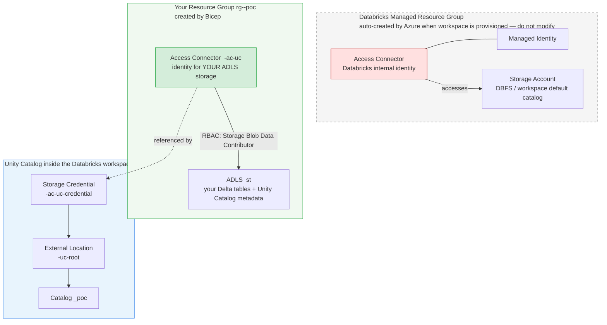
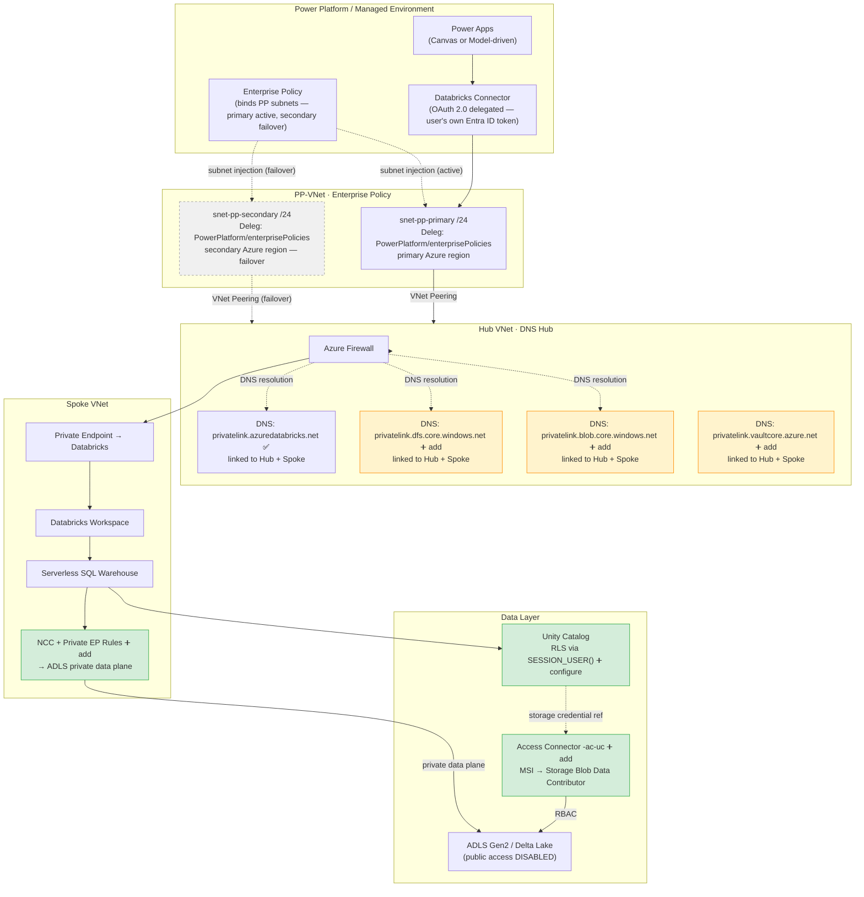

# Scenario A: Native Databricks Connector (DLP Resolved)

**Assumption**: The native Databricks connector has been moved to the Business tier in the organisation's DLP policy. All other customer requirements remain unchanged.

**Result**: The customer's original architecture is viable with targeted additions. No orchestration layer (Power Automate, Logic App) is required. The path is `Power Apps → Native Connector → Databricks`.

---

## Regions, Environments, and the Two Subnets — Clarification

A Power Platform **environment is single-region**. You need **one environment and one set of Power Apps** — not two copies. However, the Enterprise Policy requires subnets in **two different Azure regions**: the primary and secondary regions of the Power Platform region pair that the environment belongs to.

**Key point**: the two subnets are not HA slots in the same region — they serve two different Azure regions for failover. Because Azure VNets are regional resources, the primary and secondary subnets are in two separate VNets, both peered to the hub.

| Power Platform region | Primary Azure region | Secondary Azure region |
|-----------------------|---------------------|----------------------|
| United States | eastus | westus |
| UK | uksouth | ukwest |
| Canada | canadacentral | canadaeast |
| Europe | westeurope | northeurope |
| Australia | australiaeast | australiasoutheast |

> **Customer design note**: the diagram in [README §2](../README.md#2-current-proposed-architecture-customer) labels both subnets as "East US 2". Before configuring the Enterprise Policy, run `Get-EnvironmentRegion` (from the [subnet diagnostics module](https://learn.microsoft.com/en-us/troubleshoot/power-platform/administration/virtual-network#use-the-diagnostics-powershell-module)) to confirm the exact Azure region the environment landed in, then place the secondary subnet in the correct paired region.

```powershell
# Confirm which Azure region pair your environment needs
Install-Module Microsoft.PowerPlatform.EnterprisePolicies -Force
Import-Module Microsoft.PowerPlatform.EnterprisePolicies
Get-EnvironmentRegion -EnvironmentId "<your-environment-id>"
```

### How Enterprise Policy binds the subnets

`Microsoft.PowerPlatform/enterprisePolicies` is an Azure ARM resource you deploy in your subscription. It references one delegated subnet per region (primary + secondary). You then link that resource to a Power Platform Managed Environment in PPAC — this is what enables **subnet injection**: all outbound connector traffic from the environment routes through those subnets (primary active, secondary failover) instead of Power Platform's shared public egress.

Full step-by-step (PowerShell module + UI): [`networking.md §4 — Power Platform Enterprise Policy`](networking.md#4-power-platform-enterprise-policy)

Microsoft reference: https://learn.microsoft.com/en-us/power-platform/admin/vnet-support-overview

### Subnet sizing

| Environment type | Recommended IPs | Minimum subnet size |
|-----------------|----------------|-------------------|
| Production | 25–30 IPs per environment | `/27` for 1 env · `/25` for 4 envs |
| Dev / Sandbox | 6–10 IPs per environment | `/28` for 1 env · `/24` for 20 envs |

If multiple Power Platform environments share the same Enterprise Policy, size the subnet to cover all of them: `(N environments × IPs per env) + 5 reserved = total`. The `/24` in the customer design (256 IPs) is sufficient for up to ~8 production environments.

### Operational constraint — no in-place subnet changes

Once a subnet is delegated to `Microsoft.PowerPlatform/enterprisePolicies`, you **cannot change its CIDR range or the VNet's DNS settings** while the feature is active. If either needs to change, you must remove the delegation, make the change, then re-enable. Plan subnet sizing carefully before enabling.

### `Microsoft.Databricks/accessConnectors` — what it is and is not

`Microsoft.Databricks/accessConnectors` is an **Azure ARM resource type** (the Databricks Access Connector). It gives Databricks a managed identity so it can access ADLS Gen2 for Unity Catalog storage credentials. Having this resource type whitelisted in Azure Policy means you can deploy it — this is needed for the NCC/ADLS storage credential setup.

It is **not** the same as:
- The Power Platform DLP allowlist for the native Databricks connector (configured in PPAC, not Azure Policy)
- Any network ACL for connector traffic

Both approvals are needed for Scenario A — from two different teams:

| Gate | System | Team | Status |
|------|--------|------|--------|
| `Microsoft.Databricks/accessConnectors` resource type | Azure Policy | Platform / CloudX | ✅ Confirmed |
| Databricks connector in Business DLP tier | Power Platform Admin Center | Security / CloudX | 🟡 Assumed — verify in PPAC before POC |

#### Why you see two Access Connectors in Azure

When Databricks creates a workspace it automatically provisions a **managed resource group** (e.g. `<prefix>-adb-managed-<suffix>`) alongside your own. That managed RG contains three Databricks-internal resources — including its own Access Connector. Your Bicep also creates a second Access Connector (`<prefix>-ac-uc`) in your own resource group. Both are correct and intentional.



| Connector | Lives in | Purpose | Can you use it for your own storage? |
|-----------|----------|---------|--------------------------------------|
| Managed RG connector | `<prefix>-adb-managed-<suffix>` | Databricks' internal identity — accesses only Databricks' own DBFS storage | ❌ No — Databricks owns and controls it |
| `<prefix>-ac-uc` | `rg-<prefix>-poc` | Your identity — has `Storage Blob Data Contributor` on your ADLS; Unity Catalog uses it to read/write your Delta tables | ✅ Yes — this backs your storage credential and catalog |

Think of it like a building: the managed-RG connector is the landlord's master key (Databricks keeps it, opens only their own doors). `<prefix>-ac-uc` is a key you cut yourself and gave to Unity Catalog so it can open your storage. Both exist at the same time — removing either breaks something.

---

## What This Unlocks

The native Databricks connector uses **OAuth 2.0 delegated authentication** — the logged-in Power Apps user's own Entra ID session is used to call Databricks. This has two significant benefits over the orchestration-layer path:

- **No stored credentials anywhere** — the user authenticates with their own identity; no MSI, no PAT, no Key Vault lookup
- **`current_user()` works natively in Unity Catalog** — Databricks sees the actual user's UPN, so row-level security filters apply automatically without passing the UPN as a SQL parameter

### Connector authentication options

The Databricks connector offers two auth modes:

| | OAuth Connection | Service Principal |
|---|---|---|
| Databricks identity | Each user's own Entra ID UPN | The SP — not the user |
| `SESSION_USER()` / RLS | ✅ Returns the real user — per-user RLS works | ❌ Returns the SP identity — RLS breaks |
| Each user needs a Databricks account | **Yes** — must be provisioned in the Databricks workspace | No — only the SP needs one |
| User sign-in prompt | Once per user (token cached after first consent) | Never |
| Right for this scenario | ✅ Yes — RLS depends on user identity | ❌ No — unless RLS is dropped or moved to middleware (Scenario B) |

> **Bottom line**: OAuth requires every Power Apps user to have a Databricks account. Service Principal does not, but loses per-user row-level security because `SESSION_USER()` returns the SP's identity, not the user's.

### Setting up a Service Principal connection

#### Step 1 — Create an App Registration in Entra ID

```powershell
# Create the App Registration
az ad app create --display-name "sp-powerapp-databricks" --sign-in-audience AzureADMyOrg

# Create a client secret (valid 1 year)
az ad app credential reset `
  --id <application-id> `
  --years 1 `
  --display-name "powerapp-databricks-secret"
# Copy the password value — shown once only
```

Note the three values needed for the Power Apps connection:

| Field | Where to find it |
|---|---|
| **Tenant ID** | Azure Portal → Entra ID → Overview → Tenant ID |
| **Client ID** | Application (client) ID on the App Registration overview page |
| **Client Secret** | The `password` value from the credential reset output above |

#### Step 1b — Add Azure Databricks API permission and grant admin consent

The App Registration must be explicitly permitted to request Entra ID tokens scoped for the Azure Databricks resource. Without this, the connector fails with *"Credential was not sent or was of an unsupported type for this API"* — the token is never issued.

```powershell
# Add Azure Databricks user_impersonation permission
# Resource ID 2ff814a6-... is the Azure Databricks service in Entra ID (constant across all tenants)
# Scope GUID 739272be-... is the user_impersonation scope on that resource
az ad app permission add `
  --id <application-id> `
  --api 2ff814a6-3304-4ab8-85cb-cd0e6f879c1d `
  --api-permissions 739272be-e143-11e8-9f32-f2801f1b9fd1=Scope

# Grant admin consent (requires tenant admin rights)
az ad app permission admin-consent --id <application-id>
```

If you do not have tenant admin rights, open **Entra ID → App registrations → `sp-powerapp-databricks` → API permissions** in the portal and click **Grant admin consent for [tenant]**.

> Despite the name `user_impersonation`, this does **not** mean the SP impersonates users. The scope name is how Databricks registered its permission in Entra ID. What this grant actually does is allow the SP to obtain a token with the Databricks audience — required for the client credentials flow the Power Apps connector uses.

#### Step 2 — Register the SP in the Databricks workspace

The SP must exist in the workspace before Unity Catalog permissions can be granted.

```powershell
databricks service-principals create `
  --json '{"applicationId": "<client-id>", "displayName": "sp-powerapp-databricks"}' `
  --profile <prefix>-workspace
```

Or via UI: **Workspace → Settings → Identity & Access → Service Principals → Add**.

#### Step 3 — Grant Unity Catalog permissions

Run in Databricks SQL Editor. Use the Client ID (GUID) as the principal name:

```sql
GRANT USE CATALOG ON CATALOG <prefix>_poc TO `<client-id>`;
GRANT USE SCHEMA  ON SCHEMA <prefix>_poc.customers TO `<client-id>`;
GRANT SELECT      ON TABLE <prefix>_poc.customers.employees TO `<client-id>`;
GRANT MODIFY      ON TABLE <prefix>_poc.customers.employees TO `<client-id>`;
```

#### Step 4 — Update the RLS function to add an SP bypass

With SP auth `SESSION_USER()` returns the SP's client ID, not a user UPN. The domain filter never matches — every user sees zero rows. Add a bypass so the SP can read all rows:

```sql
CREATE OR REPLACE FUNCTION <prefix>_poc.customers.user_domain_filter(domain STRING)
RETURN LOWER(SESSION_USER()) LIKE LOWER(CONCAT('%@', domain))
    OR SESSION_USER() = '<client-id>';
```

This means all Power Apps users connecting via the SP see **all rows the SP was GRANTed** — per-user row filtering is lost at the Databricks layer.

#### Step 4b — Enforce per-user filtering in Power Apps (SP only)

Because Databricks cannot distinguish individual users when the SP is the caller, move the filtering into every Power Apps formula using `User().Email` — the signed-in Power Apps user's UPN.

**Read (Gallery `Items`):**
```
Filter(
    Databricks.ExecuteQuery(
        "SELECT * FROM <prefix>_poc.customers.employees",
        {timeout: 30}
    ).value,
    email = User().Email
)
```

Or push the filter into SQL to reduce data transfer:
```
Databricks.ExecuteQuery(
    "SELECT * FROM <prefix>_poc.customers.employees WHERE LOWER(email) = LOWER('" & User().Email & "')",
    {timeout: 30}
).value
```

**Write (Patch — update contractor flag for the current user's row only):**
```
Patch(
    'customers.employees',
    LookUp('customers.employees', email = User().Email),
    { contractor: DataCardValue1.Checked }
)
```

If you navigate between screens before calling `Patch`, save the selected record first — `Table1.Selected` loses context on navigation:
```
// Table1.OnSelect (before Navigate)
Set(varSelectedEmployee, Table1.Selected);
Navigate(EditScreen)

// EditScreen Patch button OnSelect
Patch(
    'customers.employees',
    varSelectedEmployee,
    { contractor: DataCardValue1.Checked }
);
Navigate(ListScreen)
```

**Security implication**: Power Apps-side filtering is **app-enforced, not database-enforced**. A user or application that calls the Databricks SQL Warehouse directly (bypassing Power Apps) sees all rows the SP was GRANTed. If database-enforced per-user filtering is a hard requirement, use **OAuth delegated auth** instead — `SESSION_USER()` returns the real user's UPN and Unity Catalog RLS applies automatically at the database layer.

| Filtering approach | Where enforced | Bypass risk | Requires Databricks account per user |
|---|---|---|---|
| Unity Catalog RLS via `SESSION_USER()` | Databricks | Cannot be bypassed from any client | **Yes** (OAuth only) |
| Power Apps `WHERE` / `Filter()` | Power Apps formula | Direct warehouse access bypasses it | No (SP) |

> **Note**: Databricks Apps (a separate product from the Power Apps connector) solves this same class of problem natively via [on-behalf-of-user authorization](https://docs.databricks.com/aws/en/dev-tools/databricks-apps/auth) — the app forwards the signed-in user's token instead of using its service principal, so Unity Catalog row filters apply automatically. The Power Apps native connector has no equivalent token-forwarding mechanism, which is why the app-side `User().Email` workaround above is required for SP auth.

#### Step 5 — Create the connection in Power Apps

`make.powerapps.com` → **Connections** → **New connection** → **Databricks** → **Service Principal**:

| Field | Value |
|---|---|
| Tenant ID | From Step 1 |
| Client ID | From Step 1 |
| Client Secret | From Step 1 |
| Server hostname | `adb-<number>.azuredatabricks.net` |
| HTTP path | `/sql/1.0/warehouses/<id>` |

---

## Requirements Alignment (Scenario A)

| Requirement | How Scenario A addresses it |
|-------------|----------------------------|
| Power Apps → Databricks connectivity | Native connector — no additional Azure services |
| No public internet | VNet injection (Enterprise Policy) routes connector traffic privately through hub-spoke |
| All traffic via enterprise hub / firewall | PP-VNet → Hub peering — existing design, no change |
| Serverless SQL Warehouse | Supported — NCC required (see below) |
| Unity Catalog + row-level security | `current_user()` returns the actual user UPN — simpler than MSI path |
| Entra ID auth, no shared credentials | Delegated OAuth — user's own session, nothing stored |
| Multiple Power Apps sharing same backend | Connector configuration is shared — all apps point at the same warehouse |
| Power Platform first, low-code | Native connector — no code, no Azure resources beyond Databricks |
| Future read + write | DML support is **unconfirmed** — `ExecuteQuery` sends arbitrary SQL; whether the connector blocks DML at the protocol layer is verified in POC Phase 1 Step 6 |

---

## What the Customer's Design Already Has (Keep As-Is)

- Power Platform Enterprise Policy with delegated subnets (primary + secondary)
- Hub-spoke VNet with peering
- Databricks workspace behind Private Endpoint (`privatelink.azuredatabricks.net`)
- DNS zone for `privatelink.azuredatabricks.net`

---

## What Must Be Added

### 1. NCC — Network Connectivity Configuration `CRITICAL`

The Serverless SQL Warehouse runs in Databricks-managed infrastructure outside the customer VNet. Without NCC, it cannot reach the private ADLS storage account and every query fails at data read.

**What to do**: Create a Network Connectivity Configuration on the Databricks workspace and add a private endpoint rule pointing at the ADLS Gen2 storage account. Databricks provisions a managed private endpoint from its network into the customer's storage.

This is a one-time workspace-level configuration — it covers all serverless SQL Warehouses and serverless notebook compute automatically.

Full steps: [`docs/networking.md → NCC`](networking.md)

---

### 2. Missing Private DNS Zones `HIGH`

The customer's current design registers only the Databricks DNS zone. ADLS and Key Vault zones are missing — traffic to those services will fall back to public IPs, which are blocked.

| DNS Zone | Required for | Action |
|----------|-------------|--------|
| `privatelink.dfs.core.windows.net` | ADLS Gen2 data access | Add + link to Hub VNet and Spoke VNet |
| `privatelink.blob.core.windows.net` | ADLS Gen2 blob protocol (used internally by Databricks) | Add + link to Hub VNet and Spoke VNet |
| `privatelink.vaultcore.azure.net` | Key Vault (if used for any other secrets) | Add + link to Hub VNet and Spoke VNet |

The networking team must also link all zones (including the existing `privatelink.azuredatabricks.net`) to the Hub VNet so DNS resolution works for traffic transiting through the hub firewall.

---

### 3. Unity Catalog Setup `HIGH`

The native connector passes the user's own Entra ID token — Unity Catalog must be configured to accept it and apply the correct permissions.

#### 3a. NCC + Storage Credential + External Location (CLI)

Run these commands after deploying infrastructure. Requires Databricks Account Admin and the Databricks CLI v1.3+ configured with both an account-level and workspace-level profile.

```powershell
# ── RBAC ──────────────────────────────────────────────────────────────────────
# Grant Access Connector MSI read/write access to the ADLS storage account
az role assignment create `
  --assignee "<access-connector-principal-id>" `
  --role "Storage Blob Data Contributor" `
  --scope "/subscriptions/<sub>/resourceGroups/<rg>/providers/Microsoft.Storage/storageAccounts/<storage>"

# ── NCC ───────────────────────────────────────────────────────────────────────
# 1. Create NCC (must be in same region as workspace)
databricks account network-connectivity create-network-connectivity-configuration `
  "ncc-<prefix>" "eastus2" `
  --profile ACCOUNT-<account-id> --output json
# Note the network_connectivity_config_id from output

# 2. Add private endpoint rule for ADLS DFS
databricks account network-connectivity create-private-endpoint-rule <ncc-id> `
  --json '{"resource_id": "<storage-resource-id>", "group_id": "dfs"}' `
  --profile ACCOUNT-<account-id> --output json
# connection_state will be PENDING

# 3. Approve the pending PE on the storage account
$peConnId = az storage account show -n <storage> -g <rg> `
  --query "privateEndpointConnections[?privateLinkServiceConnectionState.status=='Pending'].id" -o tsv
az storage account private-endpoint-connection approve `
  --id $peConnId --description "Approved for Databricks NCC Serverless"
# The PE comes from Databricks' managed subscription (prod-<region>-snp-*) — this is expected

# 4. Assign NCC to workspace
databricks account workspaces update <workspace-numeric-id> `
  --json '{"network_connectivity_config_id": "<ncc-id>"}' `
  --profile ACCOUNT-<account-id>

# 5. Verify rule is ESTABLISHED (check after ~2 minutes)
databricks account network-connectivity get-private-endpoint-rule `
  <ncc-id> <rule-id> --profile ACCOUNT-<account-id> --output json
# "connection_state": "ESTABLISHED" = ready
```

#### 3b. Storage Credential + External Location

> **How UC credential validation works with `bypass: AzureServices`**: The Databricks Unity Catalog control plane validates storage credentials by calling the ADLS DFS endpoint directly — this call does NOT go through the NCC private endpoint. With `publicNetworkAccess: Disabled` alone this call would fail. However, `main.bicep` permanently sets `bypass: AzureServices` on the storage account, which allows trusted Azure first-party services (including the Databricks UC control plane operating via the Access Connector's RBAC identity) to reach the storage even while public access is disabled. **No temporary unlock/relock step is needed.** Just run the commands below.
>
> Two separate network paths are in play:
> - **UC control plane → storage** (credential validation): allowed via `bypass: AzureServices` + Access Connector RBAC
> - **Serverless SQL Warehouse → storage** (data reads/writes): goes through the NCC private endpoint

```powershell
# Create storage credential backed by the Access Connector MSI
databricks storage-credentials create `
  --json '{
    "name": "<prefix>-ac-uc-credential",
    "azure_managed_identity": {
      "access_connector_id": "/subscriptions/<sub>/resourceGroups/<rg>/providers/Microsoft.Databricks/accessConnectors/<ac-name>"
    },
    "comment": "Access Connector MSI for Unity Catalog storage"
  }' `
  --profile <prefix>-workspace --output json

# Validate credential — all 6 operations (READ/LIST/WRITE/DELETE/PATH_EXISTS/HNS) must PASS
# Use a container NOT covered by any external location (e.g. delta)
$body = '{"storage_credential_name":"<prefix>-ac-uc-credential","url":"abfss://delta@<storage>.dfs.core.windows.net/","readonly":false}'
databricks api post /api/2.1/unity-catalog/validate-storage-credentials `
  --profile <prefix>-workspace --json $body

# Create external location — do NOT use --skip-validation
# Validation runs live here; if it fails, the credential or RBAC assignment is wrong
databricks external-locations create `
  "<prefix>-uc-root" `
  "abfss://unity-catalog@<storage>.dfs.core.windows.net/" `
  "<prefix>-ac-uc-credential" `
  --comment "Root external location for UC metastore" `
  --profile <prefix>-workspace --output json
```

> **Do not use `--skip-validation`** when creating the external location. If validation is skipped, the link between the Access Connector and the storage path is never verified — catalog table operations will fail silently later with `UC_CLOUD_STORAGE_ACCESS_FAILURE`. If validation fails here, fix the RBAC assignment or `bypass` setting before proceeding.

#### 3c. Catalog + Schema

```powershell
# Create a UC catalog with managed storage in the unity-catalog container
databricks catalogs create "<prefix>_poc" `
  --storage-root "abfss://unity-catalog@<storage>.dfs.core.windows.net/<prefix>_poc" `
  --comment "Scenario A POC catalog - Power Apps to Databricks" `
  --profile <prefix>-workspace --output json

# Create schema for customer/employee data
databricks schemas create "customers" "<prefix>_poc" `
  --comment "Customer data with RLS by SESSION_USER()" `
  --profile <prefix>-workspace --output json
```

#### 3d. Tables, Permissions, and RLS (SQL)

Run in Databricks SQL Editor or a notebook connected to the `<prefix>-sql-wh-pro` warehouse:

```sql
-- Sample table (adjust columns to match actual data)
CREATE TABLE IF NOT EXISTS <prefix>_poc.customers.employees (
  emp_id       STRING,
  full_name    STRING,
  email        STRING,
  email_domain STRING,   -- used as RLS filter key
  department   STRING,
  contractor   BOOLEAN
);

-- Grant access to the Entra ID group that contains Power Apps users
GRANT USE CATALOG ON CATALOG <prefix>_poc TO `powerapps-users@company.com`;
GRANT USE SCHEMA  ON SCHEMA <prefix>_poc.customers TO `powerapps-users@company.com`;
GRANT SELECT      ON TABLE <prefix>_poc.customers.employees TO `powerapps-users@company.com`;

-- Row-level security: filter rows where email_domain matches the caller's domain
-- SESSION_USER() returns the actual UPN of the authenticated user — no parameter needed
CREATE FUNCTION IF NOT EXISTS <prefix>_poc.customers.user_domain_filter(domain STRING)
RETURN LOWER(SESSION_USER()) LIKE LOWER(CONCAT('%@', domain));

ALTER TABLE <prefix>_poc.customers.employees
SET ROW FILTER <prefix>_poc.customers.user_domain_filter ON (email_domain);

-- Validate: should return YOUR UPN and only rows matching your domain
SELECT current_user(), SESSION_USER();
SELECT * FROM <prefix>_poc.customers.employees LIMIT 10;
```

> `SESSION_USER()` and `current_user()` both return the actual signed-in user's UPN when the Databricks connector uses **Azure Active Directory (delegated)** auth. Switch to delegated auth in Phase 2 — PAT auth in Phase 1 will return the PAT owner's UPN for all users.

| Step | What to do |
|------|-----------|
| 1 | Assign metastore to the Databricks workspace (if not already done) — `databricks account metastore-assignments get <workspace-id>` |
| 2 | Grant Access Connector MSI `Storage Blob Data Contributor` on the ADLS storage account |
| 3 | Create storage credential + external location (see §3b above) |
| 4 | Create catalog `<prefix>_poc` with managed storage root, create schema `customers` |
| 5 | Grant `USE CATALOG`, `USE SCHEMA`, `SELECT` to the Entra ID group(s) containing Power Apps users |
| 6 | Configure RLS using `SESSION_USER()` (see SQL above) |

---

### 4. DLP Policy Confirmation `REQUIRED`

Move the Databricks connector from the blocked list to the **Business** tier in the organisation's DLP policy. This is the single gate for this entire scenario — without it, the connector cannot be used regardless of networking.

**Owner**: Security / CloudX team.

Once moved, all Power Apps in the environment can use the connector without individual approvals.

---

### 5. Hub VNet Reverse Peerings `HIGH`

The PP-VNet peers to Hub, but the Hub must also peer back to PP-VNet for return traffic to route correctly. This is a standard hub-spoke networking step that is typically owned by the networking team.

**Owner**: Networking team.

---

## POC Checklist — Scenario A

A minimal POC can be validated in two phases. Phase 1 tests the connector works before touching private networking; Phase 2 adds the full private path.

### Deploy the infrastructure

```powershell
# POC — stub hub created automatically, workspace publicly accessible
.\deploy\deploy.ps1 -ResourceGroup "rg-powerapps-databricks-poc" -Location "eastus2"

# With the customer's existing Hub VNet
$hub = "/subscriptions/<sub-id>/resourceGroups/<hub-rg>/providers/Microsoft.Network/virtualNetworks/<hub-vnet>"
.\deploy\deploy.ps1 `
  -ResourceGroup "rg-powerapps-databricks" `
  -Location "eastus2" `
  -SecondaryLocation "eastus" `
  -HubVNetId $hub
```

The script deploys both PP-VNets (primary + secondary in the correct paired region), the Databricks spoke, all private endpoints and DNS zones, ADLS, and the Access Connector. It then prints a 9-step post-deploy guide.

> **`-SecondaryLocation`**: defaults to `eastus` (US pair). Run `Get-EnvironmentRegion` first to confirm the correct paired region for your specific PP environment.

---

### Phase 1 — Connector test against the real environment

Goal: confirm DLP is cleared, the connector can authenticate, RLS works, and verify whether the connector supports write operations. All infrastructure is already in place — no new Azure resources needed for this phase.

#### Step 1 — Get the warehouse connection details

In Databricks workspace → **SQL Warehouses** → `<prefix>-sql-wh-pro` → **Connection details** tab. Note:

| Field | Where to find it | Example format |
|-------|-----------------|----------------|
| Server hostname | Connection details tab | `adb-<number>.azuredatabricks.net` |
| HTTP path | Connection details tab | `/sql/1.0/warehouses/91325fa33dc27ee6` |

#### Step 2 — Generate a PAT

Databricks workspace → top-right user menu → **Settings** → **Developer** → **Access tokens** → **Generate new token**. Set a short lifetime (7 days is fine for POC). Copy the token — it is only shown once.

> PAT auth is used for Phase 1 only. With PAT, `SESSION_USER()` returns the **PAT owner's UPN** — not the signed-in Power Apps user. RLS will filter by the PAT owner's domain. This is expected; Phase 2 switches to delegated Entra ID auth so each user's own identity flows through.

#### Step 3 — Create a Canvas App and add the connector

1. Go to [make.powerapps.com](https://make.powerapps.com) → **+ Create** → **Blank Canvas App** (phone or tablet layout)
2. **Add data** (left panel) → search for **Databricks** → select it
3. Enter:
   - **Server hostname**: from Step 1
   - **HTTP path**: from Step 1
   - **Access token**: PAT from Step 2
4. Click **Connect**

If the connection is rejected at this step, the DLP policy change has not yet taken effect — verify in PPAC before continuing.

#### Step 4 — Connectivity test

Add a **Label** control. Set its `Text` property to:

```
Text(Databricks.ExecuteQuery("SELECT current_user(), SESSION_USER()", {timeout: 30}))
```

Run the app. The label should show the PAT owner's UPN. If it shows an error, check the PAT and connection details.

#### Step 5 — Read test against the real table

Add a **Vertical Gallery**. Set `Items` to:

```
Databricks.ExecuteQuery("SELECT emp_id, full_name, email, department FROM <prefix>_poc.customers.employees LIMIT 20", {timeout: 30}).value
```

Set gallery label `Text` fields to `ThisItem.emp_id`, `ThisItem.full_name`, etc.

Expected: only rows where `email_domain` matches the PAT owner's domain appear (RLS is active). With PAT owned by `admin@contoso.onmicrosoft.com`, only the 6 `contoso.onmicrosoft.com` rows should return.

#### Step 6 — Write test (confirms whether connector is read-only)

Add a **Button**. Set `OnSelect` to:

```
Databricks.ExecuteQuery(
    "INSERT INTO <prefix>_poc.customers.employees (emp_id, full_name, email, email_domain, department, contractor) VALUES ('E999', 'Write Test', 'writetest@contoso.onmicrosoft.com', 'contoso.onmicrosoft.com', 'IT', false)",
    {timeout: 30}
)
```

Click the button and check the result:

| Result | What it means |
|--------|--------------|
| No error + row appears in Step 5 gallery on refresh | Connector supports writes — docs need updating |
| HTTP 403 / Unity Catalog permission error | Connector issued the write but UC blocked it — also means connector is NOT read-only |
| Connector-level error rejecting the SQL | Connector is genuinely read-only at the connector definition layer |

After the test, clean up: run `DELETE FROM <prefix>_poc.customers.employees WHERE emp_id = 'E999'` in the Databricks SQL Editor.

> **Note on auth**: The connector supports both PAT and Entra ID (delegated OAuth). Use PAT for Phase 1. Switch to Entra ID in Phase 2 — `SESSION_USER()` returns the actual signed-in user's UPN only with delegated auth, which is required for per-user RLS to work correctly in production.

### Phase 2 — Private networking + Unity Catalog

Goal: route all traffic privately, enforce RLS, remove PAT.

| # | Step | Doc |
|---|------|-----|
| 1 | Deploy PP-VNet + delegated subnets (or confirm existing) | `deploy/deploy.ps1` |
| 2 | Configure Enterprise Policy — bind subnets to Managed Environment | [`networking.md §4`](networking.md#4-power-platform-enterprise-policy) |
| 3 | Confirm Hub VNet reverse peerings are in place | [`networking.md §2`](networking.md#2-hub-vnet-reverse-peerings) |
| 4 | Add missing private DNS zones (ADLS dfs/blob, Key Vault) | [`networking.md §3`](networking.md#3-dns-zone-linking-to-hub-vnet) |
| 5 | Configure NCC — private endpoint rules for ADLS | [`networking.md §1`](networking.md#1-ncc-configuration-critical--gap-1-fix) |
| 6 | Deploy Databricks Access Connector (`Microsoft.Databricks/accessConnectors`) | Unity Catalog docs |
| 7 | Initialize Unity Catalog — metastore, catalog, schema, permissions | See RLS section below |
| 8 | Switch connector auth from PAT to **Azure Active Directory** (delegated) | Databricks connector → Edit connection |
| 9 | Validate `current_user()` returns the signed-in user's UPN in a SQL query | `SELECT current_user()` in a warehouse notebook |
| 10 | Add RLS function + table filter (see below) and verify per-user row filtering | |

---

## Architecture Diagram (Scenario A — complete)



Legend: ✅ already present · ➕ must be added

---

## Remaining Gaps and Effort

| Item | Effort | Owner | Blocker? |
|------|--------|-------|----------|
| DLP — allowlist Databricks connector | Low — policy change only | Security / CloudX | Yes — nothing works without this |
| NCC — private endpoint rules for ADLS | Medium — Databricks Accounts API | Databricks / Platform team | Yes — all queries fail without this |
| DNS — add ADLS dfs/blob zones | Low — ARM/Bicep or portal | Networking team | Yes — storage traffic falls back to public internet |
| Hub VNet reverse peerings | Low | Networking team | Yes — return traffic fails without this |
| Unity Catalog — permissions + RLS | Medium — SQL commands | Data Platform team | Yes — users cannot read data without this |
| DNS — Key Vault zone | Low | Networking team | Only if Key Vault is accessed privately |

---

## Limitations of Scenario A

| Limitation | Detail |
|-----------|--------|
| **DML support unconfirmed** | The `ExecuteQuery` action sends arbitrary SQL to the SQL Warehouse — the connector does not visibly restrict DML at the protocol layer. Whether INSERT/UPDATE/DELETE succeed is controlled by Unity Catalog permissions and is verified empirically in POC Phase 1 Step 6. If the connector proves read-only at the connector layer (not just at the UC permission layer), the write path requires Scenario B or C. Do not assume read-only until the write test in Step 6 is run. |
| **Per-app connector setup** | Each new Power App must configure the connector independently (warehouse URL, credentials). A central change to the warehouse requires updating every app. At >3–4 apps this becomes maintenance overhead — Scenario C (APIM) removes this coupling. |
| **No retry or error handling** | Connector failures (warehouse cold start timeout, transient errors) surface directly in the Power App as unhandled errors. Each app team is responsible for its own error UX. |
| **Audit trail** | Read and write operations are captured in Databricks query history per user (delegated auth). If write operations are needed and the connector supports them, no separate audit path is required — Databricks logs the executing user's UPN. |

---

## When to Move Beyond Scenario A

| Trigger | Move to |
|---------|---------|
| Write / ingestion requirement arrives **and** POC Step 6 confirms connector blocks DML | Scenario B (Logic App orchestration) or Scenario C (APIM) |
| More than 3–4 Power Apps sharing the same warehouse | Scenario C (APIM) — centralises connector config and auth |
| Other application types need Databricks access (web, mobile, backend) | Scenario C (APIM) — single gateway for all client types |
| AI Foundry integration required | Scenario C (APIM) — APIM routes to both Databricks and AI Foundry |


